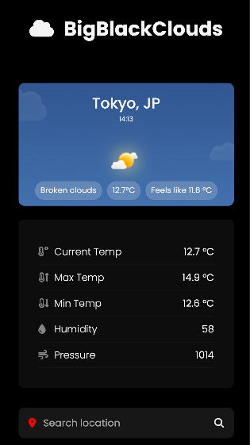

## Flask-Weather-App

This is a simple Weather Web App made using Python Flask Web Framework, JavaScript and openweathermap API.

## Features

- Fetch current weather data such as temp, humidity, pressure and status
- Change weather background according to time of day
- Change weather icon according to time of day
- Fully Responsive

## Preview

